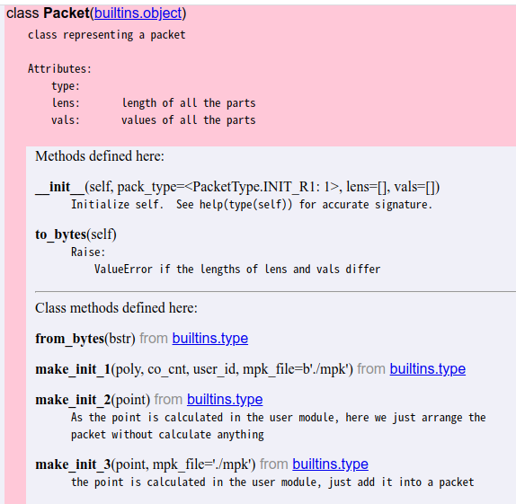

# 2020-07-17

添加一个功能需要关注的地方

## 1 Packet

每一轮的包都需要有一个类型枚举，位于`Packet.PacketType`，然后（最好）每一轮的包都要写一个`make_xxx`函数。例如，私钥请求第一轮的类型为`Packet.PacketType.SK_REQUEST_INIT`，同时存在一个做包函数`make_sk_request_init`（后缀和类型是一样的，只是大小写不同）返回这一轮的包，函数参数按需选择。对于需要加密的包，使用`PLAIN`和`SEC`进行区分。

## 2 User 

`User`存储配置相关的东西（ID、网络地址、参数文件），所以所有在`crypto_c_interface`里定义的函数，需要在`User`里包装一下，获取相关参数会容易一些，例如：`ibe_encrypt`的包装如下

```python
class User:
  ...
  def ibe_encrypt(self, mode="global", m=b"", user_id=b""):
      """ 
      mode is in ["global", "admin", "local"]
      """
      mpk_file = b""
      if mode == "global":
          mpk_file = self.global_mpk_file
      elif mode == "admin":
          mpk_file = self.admin_mpk_file
      elif mode == "local":
          mpk_file = self.local_mpk_file
      else:
          raise UserError()
      ibe_encrypt(m, mpk_file, user_id)
```

## Server 

`server.py`定义服务器响应逻辑，主要函数是`gen_action_from_data`，它根据收到的数据产生一个`Action`对象，`run`函数作为一个对这些`Action`进行调度和执行。


## Client

`client.py`与`server.py`差不多，只是多了一个`gen_action_from_args`，这是根据用户给定参数产生`Action`对象的，`run`函数依旧作为`Action`的调度函数

# 2020-07-07

## 1 Packet 模块开发指南

目前的Packet类结构如下



两个跟通信模块交互的接口：to_bytes和from_bytes，分别实现从包到字节流和从字节流到包的转换。

```python
data = packet.to_bytes()
client.send(data, ...)
```

```python
# server received some data
packet = Packet.from_bytes(data)
```

三个属性：type, lens和vals。比如秘密共享第二阶段的包，需要发送两个点$share \times P_1$和$share \times P_2$

```python
packet = Packet()
packet.type = Packet.PacketType.INIT_R2
packet.lens = [65, 129]
packet.vals = [shareP1, shareP2]
client.send(packet.tp_bytes(), ...)
```

然后对于常用的包结构，可以用类函数`make_xxx`把它包起来，然后在外部使用`Packet.make_xxx`做包。

## 2 运行指南

1. 配置C库位置
```python
# constant.py
ROOT_DIR = "/home/{path-to-find-IBE}/IBE"
```

2. 配置用户json文件，例如[init_server.json](../example/init/server1/init_server.json)

3. 如果要运行顶级功能，配置顶级用户目录，如[top_user_list.json](../example/init/top_user_list.json)并在用户配置文件中加入 

```json 
"top_user_list": "../top_user_list.json"
```

4. 链接python目录
```sh
ln -s {path-to-IBE}/src/python .
```

5. 运行server。运行server不需要指定功能，直接 
```sh 
python3 python/server.py -c {config-file}
```

6. 运行client，需要指定运行的功能
```sh 
python3 client.py -h
usage: client.py [-h] [--server-ip SRV_ADDR] [--server-port SRV_PORT]
                 [--action {init,sk,comm}] [-c [CONFIG_FILE]]

IBE Client

optional arguments:
  -h, --help            show this help message and exit
  --server-ip SRV_ADDR
  --server-port SRV_PORT
  --action {init,sk,comm}
                        the valid actions are: {'init': 'invoke an
                        initialization', 'sk': 'request for the private key',
                        'comm': 'initialize a secret session'}
  -c [CONFIG_FILE]      configuration file
```

推荐使用配置文件，不要使用前两个选项（我没测过）。例如，运行初始化init，可以使用
```sh 
python3 client.py -c {config-file} --action init
```
如果其他顶级节点都在线，可以生成顶级的mpk和sk文件。

## 3 Crypto测试

增加了私钥测试，运行指令

```sh
python3 python/crypto_c_interface.py -e -id {user-id} -sk {sk-file} -mpk {mpk-file}
```

# 2020-05-29

- [ ] 私钥请求
- [ ] 安全信道建立的逻辑

完善指南：

完善[client.py](../src/python/client.py)里的`gen_action_from_args`里sk和comm两种业务逻辑。这里只是通过用户终端命令产生`Action`对象，即只是通信初始化的一个包。

主要的包在`gen_action_from_data`里，这里根据client收到的数据进行分析，产生相应动作。这里就是实现原来的packet模块handle的功能，可以先实现看看是否需要定义packet结构。主要是返回一个`Action`对象，这个类在[action.py](../src/python/action.py)中，也可以按需修改。

然后在`Client::run`的while循环里，会不停地根据接受的包执行相应的动作，其实就是原来的packet模块里send的功能。如果`Action`的相关结构发生变化，记得修改这个位置。

然后服务器端[server.py](../src/python/server.py)也是类似的。`handle_thread`类似于client的`run`，里面有while循环。`gen_action_from_data`也就基本一样了。

所以这块主要就是把原来packet模块里的那些逻辑挪进来，过程里可能会有参数的增加、结构的增加或者封装，可以按自己的想法来做。


----------------------------------------------

# 目录结构 

* `docs` : 文档 (doxygen)， 可以基于注释生成， 命令：`doxygen Doxyfile`
* `src` : 源代码
* `protocol.md` : 协议描述

## 代码结构 

### 头文件 

全局的头文件存储在`include`中，与GmSSL相关的头文件在`include/openssl`中。

IBE相关 ： `include/openssl/sm9.h`
大数运算 ：`include/openssl/bn.h`
椭圆曲线运算 ：`include/openssl/ec.h`
输入输出 ：`include/openssl/bio.h`

### 库

库都存在`lib`里，不用改 

### crypto 

AES块加密(CBC)和IBE(sm9-256)都已经实现，需要的时候用就可以了。
后面签名的部分你们可以加在这里面，或者再新建一个目录，都可以。

### ss(Secret Sharing)

这一块是重灾区。因为在GmSSL库里我没有找到秘密共享相关的内容，所以这部分是要自己实现的。
主要需要的功能有：

1. 产生多项式 
2. 多项式求值
3. 拉格朗日多项式值的计算 

（这三个实现了，没测试） 

4. 点乘、点加（这些是可以直接在`openssl/ec.h`里找到的)。然后需要构思一下怎么使用它们
构建最初的系统。可以把顶级节点的ID和数量写到配置文件里，作为部署参数来做。
5. 获取ID的哈希值（就是把一个ID映射到椭圆曲线上的一个点）。这一步GmSSL库实现了，但是不在`openssl`的头文件里。我推荐是用`SM9_extract_public_key`，然后从`SM9PublicKey`这个数据结构里把那个点找出来。你们也可以尝试复制库里的代码到新的文件里，但那样要搬运很多代码和头文件，应该也不会简单。

我目前能想到的就是这些，这部分解决了，应该大部分就解决了。

### sys 

因为`ss`还没有完成，所以`sys`这边只有一个基于单节点的系统建立，就是直接跑一遍SM9的`setup`函数。这个`setup`函数会生成一个`SM9PublicParameters`和一个`SM9MasterSecret`。然后要是生成不同的域，就相当于把`SM9PublicParameters`里面的`PPub`(估计是这个，对应理论里面的`sP`)和`SM9MasterSecret`里面对应`s`的那个值换掉然后存到这个域的配置文件里就可以了。

### comm 

所有跟通信(socket)相关的代码都在这里面。这里的代码是我在github上扒的，比较复杂。大概思路是在主进程外再开一个进程用于监听。所以相当于是有两个进程再运行。我设想的结构是主进程跟用户交互，接受用户的终端输入发送网络包，然后监听进程收到某个网络包之后进行处理，输出可阅读的信息到终端。

所以我一直想把通信跟打包这两件事分开，但现在这两部分的代码都还搅在comm这个目录下，我建议你们可以把里面跟网络包相关的部分移到packet目录里，这样更清晰一些。

### packet 

这个就是打包和解包的部分。大概思路是分五个阶段发，五个阶段收：

```
发 ： SEND_APP_PACKET -> SEND_SIGN -> SEND_END -> SEND_SEC_PACKET -> SEND_DONE
收 :  RECV_SEC_PACKET -> RECV_DEC -> RECV_VERIFY -> RECV_APP_PACKET -> RECV_DONE  
```

然后包一个handle或send函数，死循环，遇到`RECV_DONE`或者`SEND_DONE`状态时发送或输出内容。

> 这部分只是我的想法，你们如果觉得有什么问题可以随便改 


## 协议 

协议是两层的，应用层协议和安全协议。安全协议的头主要是用来指示加密算法和相关参数的，应用层协议是用来标记这个包是干什么的（私钥请求、秘密共享、普通的要输出的包 ……） 

## 数据结构 

GmSSL的数据结构要clone它的代码然后进去扒，用VS Code的话下一个Intellicense可以帮你找，但有时候找的也不准，所以学一学`grep`命令的用法是很必要的。

自定义的数据结构都在`include/ds.h`里，主要就是两个包的结构和打包解包的运行环境，包结构我觉得不用动，`PacketCTX`可以按需求增加。

## 配置 

现在的配置都在头文件里了，有一个`config.h`，代码写完之后可以考虑用别的配置文件形式 

