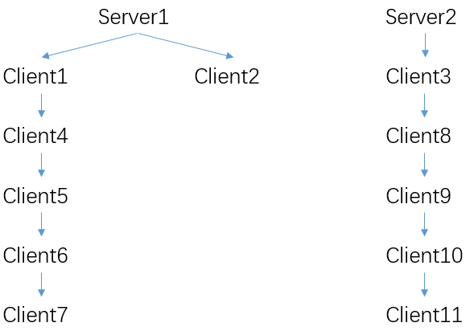

## 编译

1. gmssl库

```sh
git clone https://github.com/w158rk/GmSSL.git
mkdir build
cd build
../config
make
```

2. IBE部分

```sh
git clone -b python https://github.com/w158rk/IBE.git
export IBE_LIB={path-to-GmSSL}/build
mkdir build
cd build
cmake ../
make
```

---

## 运行指南

1. 配置C库位置
```python
# constant.py
ROOT_DIR = "/{path-to-find-IBE}/IBE"
```

2. 配置用户json文件，例如[init_server.json](../example/init/server1/init_server.json)

其中，能作为父节点的json文件需要有`admin_mpk_file`，`admin_msk_file`，`admin_sk_file`

顶级节点的json文件需要有`global_sk_file`

3. 如果要运行顶级功能，配置顶级用户目录，如[top_user_list.json](../example/init/top_user_list.json)并在用户配置文件中加入 

```json 
"top_user_list": "../top_user_list.json"
```

现有`example`为测试文件夹，`init`用于顶级参数生成的测试，`sk`用于私钥申请的测试，`comm`用于会话密钥申请的测试

其中`comm`文件夹下各节点的关系为：



1. 链接python目录
```sh
ln -s {path-to-IBE}/src/python .
```

5. 运行server。运行server不需要指定功能，直接 
```sh 
python3 python/server.py -c {config-file}
```

6. 运行client，需要指定运行的功能
```sh 
python3 client.py -h
usage: client.py [-h] [--server-ip SRV_ADDR] [--server-port SRV_PORT]
                 [--action {init,sk,comm}] [-c [CONFIG_FILE]] 
                 [--addr comm_addr] [--port comm_port] [--id comm_id]
                 [--key {sm4,IOT}]
```

---

## API及相关参数

### 顶级的初始化

**描述：** 根据`top_user_list.json`文件中定义的顶级节点，对系统的顶层进行初始化，最后每个顶级节点得到自己顶级域的公共参数`global_mpk`和顶级域的私钥`global_sk`文件

**初始化方式：**

1. 需要存在`top_user_list.json`文件对顶级每个节点的`id`、`addr`、`port`进行定义

2. 每个顶级结点需要有自己的`init_server.json`文件，用于定义`top_user_list.json`文件的位置，顶级秘密共享生成的文件名以及自己的`id`、`addr`、`port`

3. 链接python目录
```sh
ln -s {path-to-IBE}/src/python
```

4. 除最后一个顶级结点外运行：
```sh
python3 python/server.py -c {config-file}
```

最后一个顶级结点运行：
```sh
python3 python/client.py -c {config-file} --action init
```

随即开始进行顶级的秘密共享，最后为每个顶级结点生成相关参数文件

5. 最后，所有顶级结点返回`The initialization has finished`，即表示顶级初始化结束

**参数：**

| 参数名 | 必选 | 类型 | 说明 |
| :-: | :-: | :-: | :-: |
| config-file | 是 | string | 配置json文件名 |
| action | 是 | string | init用于顶级初始化 |

**返回实例：**

顶级的初始化会返回5个文件：

`mpk-global.conf`、`mpk-global.conf.len`、`mpk-global.conf.nouse`、`mpk-global.conf.nouse.len`、`sk-global.conf`

**返回参数说明：**

- `mpk-global.conf` ：顶级公共参数文件，字节流格式，长度为239位
- `mpk-global.conf.len` ：顶级公共参数长度文件
- `mpk-global.conf.nouse`、`mpk-global.conf.nouse.len` ：中间文件(不用管)
- `sk-global.conf` :顶级私钥文件，字节流格式，长度为381位

**备注：** 无

---

### 私钥的获取

**描述：** 节点根据自己的json文件，向自己的父节点发送获取私钥的请求，若成功，获取顶级域的公共参数`mpk_global`，自己父节点域的公共参数`mpk_local`、自己在父节点域中的私钥`sk_local`以及自己的身份验证信息`certificate`

**初始化方式：**

1. 每个结点需要有自己的json文件，用于定义`top_user_list.json`文件的位置，私钥获取生成的文件名、自己的`id`、`addr`、`port`以及自己父节点的相关信息

2. 链接python目录
```sh
ln -s {path-to-IBE}/src/python
```

4. 父节点需要先进行监听，即运行：
```sh
python3 python/server.py -c {config-file}
```

子节点运行：
```sh
python3 python/client.py -c {config-file} --action sk
```

随即开始进行私钥的获取，最后子节点获取相关参数文件

5. 最后，子节点结束运行并返回相关参数文件，即表示私钥的获取结束

**参数：**

| 参数名 | 必选 | 类型 | 说明 |
| :-: | :-: | :-: | :-: |
| config-file | 是 | string | 配置json文件名 |
| action | 是 | string | sk用于私钥的获取 |

**返回实例：**

私钥的获取后子节点会返回4个文件：

`mpk-global.conf`、`mpk-local.conf`、`sk-local.conf`、`certificate.conf`

**返回参数说明：**

- `mpk-global.conf` ：顶级公共参数文件，字节流格式，长度为239位
- `mpk-local.conf` ：父节点域公共参数文件，字节流格式，长度为239位
- `sk-local.conf` ：父节点域中自己的私钥文件，字节流格式，长度为381位
- `certificate.conf` :身份验证文件，字节流格式

**备注：**

1. 父节点在收到请求时会先检查自己的证书是否存在(若不存在，顶级节点会自动生成自己的证书`certificate.conf`)以及自己节点域的参数文件是否完整，包括`mpk-admin.conf`、`mpk-admin.conf.len`、`msk-admin.conf`、`msk-admin.conf.len`、`sk-admin.conf`，若不完整父节点会先自动生成自己的节点域

2. 子节点在申请时会先生成一个sm4的密钥加密发送给自己的父节点，之后父节点会使用该密钥秘密返回子节点的私钥和证书信息

---

### 会话密钥的协商

**描述：** 两个节点协商出彼此的会话密钥，其中协商出的会话密钥可分为无时限的sm4密钥以及存在时限的IOT密钥两种类型

**初始化方式：**

1. 每个结点需要有自己的json文件，用于定义`top_user_list.json`文件的位置，文件名、自己的`id`、`addr`、`port`

2. 进行会话密钥的两个节点需要已经获取了自己在父节点域中的公共参数`local_mpk`、私钥`local_sk`以及身份验证信息`certificate`

3. 链接python目录
```sh
ln -s {path-to-IBE}/src/python
```

4. 节点A需要先进行监听，即运行：
```sh
python3 python/server.py -c {config-file}
```

节点B运行：
```sh
python3 python/client.py -c {config-file} --action comm --addr {comm_addr} --port {comm_port} --id {comm_id} --key{sm4,IOT}
```

随即开始进行会话密钥的协商，最后两个节点获取相关参数文件

5. 最后，节点A返回相关参数文件，节点B结束运行并返回相关参数文件，即表示会话密钥协商的结束

**参数：**

| 参数名 | 必选 | 类型 | 说明 |
| :-: | :-: | :-: | :-: |
| config-file | 是 | string | 配置json文件名 |
| action | 是 | string | comm用于会话密钥的协商 |
| addr | 是 | string | 进行会话密钥协商的节点的地址 |
| port | 是 | int | 进行会话密钥协商的节点的端口 |
| id | 是 | string | 进行会话密钥协商的节点的ID |
| key | 否 | string | 会话密钥协商出的密钥类型，默认为sm4，IOT为存在时限的密钥类型 |

**返回实例：**

会话密钥协商结束后节点A会返回1-2个文件：

`{sm4,IOT}-B.conf`、`mpk-B.conf`

节点B会返回1-2个文件：

`{sm4,IOT}-A.conf`、`mpk-A.conf`

**返回参数说明：**

- `{sm4,IOT}-B.conf` 、`{sm4,IOT}-A.conf`：生成的会话密钥的文件。字节流格式，其中sm4密钥长度为16位，IOT密钥长度为164位
- `mpk-B.conf` ：节点B的公共参数文件，字节流格式，长度为239位
- `mpk-A.conf` ：节点A的公共参数文件，字节流格式，长度为239位

**备注：**

1. 节点A在收到节点B的申请会话密钥的信息的时候，会根据节点B发送来的公共参数进行模式的自动判断，分为3种模式：
   
   1. 模式1：节点A和节点B是同一父节点域下的子节点，节点A和节点B均使用自己的父节点域的公共参数`local_mpk`以及自己在父节点域下的私钥`local_sk`进行会话密钥的协商，不进行证书的身份信息验证

   2. 模式2：节点A和节点B是跨域间的节点，节点A和节点B对对方发来的公共参数和身份验证信息进行验证，若验证通过，保存对方的公共参数，并使用其进行后续的会话密钥协商

   3. 模式3：节点A是节点B的父节点，节点A使用自己域的公共参数`admin_mpk`和私钥`admin_sk`，节点B使用自己父节点域的公共参数`local_mpk`和私钥`local_sk`进行会话密钥的协商，不进行证书的身份信息验证

2. 只有在节点A和节点B是跨域间节点，然后进行会话密钥的协商时会生成对方节点的公共参数文件

---

### 有关json文件的配置

**顶级初始化的json文件：**

若要实现顶级初始化的功能，首先需要配置顶级初始化的json文件`top_user_list.json`。该json文件内需要对所有顶级结点进行列举，并说明每个顶级结点的`id`、`addr`、`port`

**节点的json文件：**

每个节点需要有一个自己的json文件，节点的json文件需要对顶级初始化的json文件`top_user_list.json`位置进行表明，并定义自己的相关参数和运行过程中生成的文件名。节点可分为父节点和子节点两类：

1. **子节点的json文件：**

除顶级初始化的json文件配置外，需要包括自己的`id`、`addr`、`port`以及自己父节点的`id`、`addr`、`port`的配置，还需要包括关于`log`、`global_mpk_file`、`local_mpk_file`、`local_sk_file`、`certificate_file`文件名的配置

1. **父节点的json文件：**

若一个节点能作为父节点为其他节点分发密钥，则除了子节点的json文件中存在的相关参数及文件名的配置外，还需要加上`admin_mpk_file`、`admin_msk_file`、`admin_sk_file`这三类自己生成的节点域文件的配置 

### 参数

主要的参数变量在[constant.py](../src/python/constant.py)文件中，包括的相关数据有：

- BUFFER_SIZE：BUFFER大小，暂时可以不动
- RECEIVE_BUFFER_SIZE：socket通信过程中使用到的用于传递data的BUFFER大小
- KEY_DUR_TIME：IOT_key的使用期限，可以根据需要更改，[constant.py]中的只是init部分的定义，具体更改的位置为[link](../src/python/client.py#L168)
- ROOT_DIR：`IBE`代码的位置，使用代码前根据自己的ROOT更改
- EC_POINT_LEN、POINT_LEN：椭圆曲线的相关数据，不用动

---

## 代码架构

### 证书的结构

```python
class Certificate:
    _valid_attrs = [
        "header",
        "payload",
        "sig"
    ]

class Header:
    _valid_attrs = [
        "type",
        "alg"
    ]

class Payload:
    _valid_attrs = [
        "iss",
        "aud",
        "exp",
        "nbf",
        "iat",
        "mpk",
        "parent"
    ]

class Signature:
    _valid_attrs = [
        "header",
        "payload",
        "sig"
    ]

```

其中，`iss`为证书的发布用户，`aud`为证书的授权用户，`mpk`为该用户的`local mpk`，'parent'为该用户父节点的证书，`sig`为用于验证证书的签名

顶级节点在初始阶段会为自己生成证书，使用的mpk为`global_mpk`，其余节点都是由父节点分配sk的同时获取，使用的mpk为`local_mpk`


### IOT会话密钥的结构

```python
class IOT_key:

    _valid_attrs = [
        "time_stamp",
        "end_time",
        "key"
    ]
```

其中，`time_stamp`为该key开始生效的时间戳，`end_time`为生效到期的时间戳，`key`为协商出的sm4会话密钥

---

## 相关测试数据

现阶段代码测试的数据如下：

- 第二层节点sk请求 发送数据最大量5006
- 第三层节点sk请求 发送数据最大量8398
- 第四层节点sk请求 发送数据最大量12902
- 第五层节点sk请求 发送数据最大量18894
- 第六层节点sk请求 发送数据最大量18894
- 第七层节点sk请求 发送数据最大量32768

- 第二层节点密钥协商 发送数据最大量3574 验证时间92.76ms
- 第三层节点密钥协商 发送数据最大量6110 验证时间145.40ms
- 第四层节点密钥协商 发送数据最大量9486 验证时间186.30ms
- 第五层节点密钥协商 发送数据最大量13986 验证时间234.78ms
- 第六层节点密钥协商 发送数据最大量19990 验证时间319.94ms

因此目前通信data开辟的最大数据量个数为40000，具体定义在[constant.py](../src/python/constant.py)中的`RECEIVE_BUFFER_SIZE`里