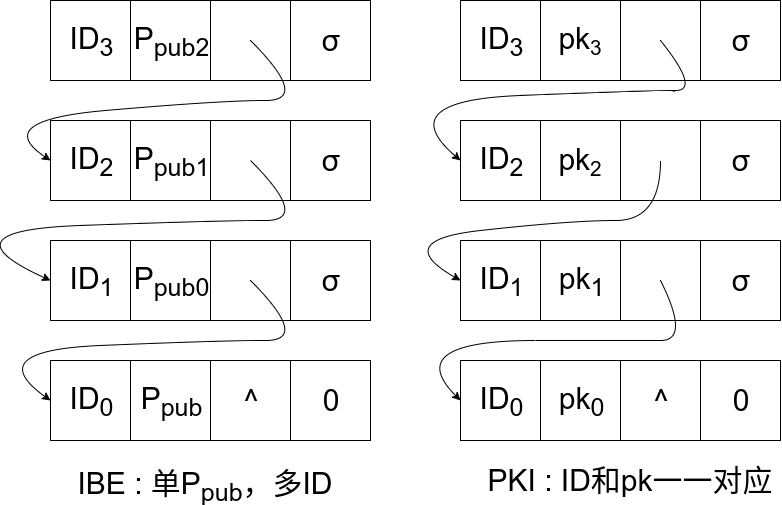

# IBE VS PKI

其实在密钥结构和证书结构上两者的差别已经不大了，主要的差别在于安全假设上 

在PKI的多根CA系统中，是需要假设每个节点同时信任$N$个根CA。但在IBE系统中，节点只需要信任
自己的祖先节点，不需要信任其他的根

## 证书结构的对比

最底层的证书都是不包含签名的，也就是最底层的信息都是默认信任的。所以对于PKI系统，系统参数是
$N$个$(ID_i, pk_i)$对。对IBE系统来说，系统参数只是$P_{pub}$，甚至都不需要存储顶级节点的ID。

理由：如果攻击者不是顶级节点却声明自己是某个顶级节点，因为他没有$P_{pub}$对应的私钥，所以

1. 他不能为自己的下级节点产生有效的证书
2. 如果某个合法用户向他发送了用$ID$和$P_{pub}$加密的信息，他也是无法获取的 

然后看PKI系统，如果不存储根CA的公钥而只存储ID，那么攻击者声明他是根CA（使用某一个根CA的公钥），合法用户是无法辨别他是不是真的根CA的。

# SMX VS SM9 

## 加密 

### SM9

公钥 ： $Q = H(hid||id)P_1 + P_{pub} = (h'+s)P_1$($H$是sha256或sm3)

私钥 ： $de = \frac{s}{s+h'}P_2$

加密 ： 

$C_1 = rQ$

$C_2 = m \oplus \hat{e}(P_{pub}, P_2)^r = m \oplus \hat{e}(sP_1, P_2)^r$

解密 ：

$m' = C_2 \oplus \hat{e}(C_1, de) = C_2 \oplus \hat{e}(r(h'+s)P_1, \frac{s}{s+h'}P_2) = m$

这种情况的de是无法用秘密共享算的

签名：

$h = {H_2}(M\parallel e{({P_1},{P_{pub}})^r},N)$

$S = (r - h)\frac{{s{P_1}}}{{h' + s}}$

其中，$h' = {H_1}(ID\parallel hid,N)$

签名的验证：

验证H是否等于h，其中$H = {H_2}(M'||w',N)$，即验证M'是否等于M，w'是否等于$e{({P_1},{P_{pub}})^r}$

其中，$P = h'{P_2} + {P_{pub}}$，$g = e({P_1},{P_{pub}})$

若正确：

$\begin{array}{l}
w' = e(S,P) \cdot {g^h}\\
 = e{(\frac{{s{P_1}}}{{h' + s}},h'{P_2} + s{P_2})^{r - h}} \cdot e{({P_1},{P_{pub}})^h}\\
 = e{({P_1},s{P_2})^{r - h}} \cdot e{({P_1},s{P_2})^h} = e{({P_1},s{P_2})^r}
\end{array}$

---

### SMX

公钥 ： 不变 

私钥 ： $de = sQ = s(s+h')P_1$ 

加密 ： 

$C_1 = rP_2$

$C_2 = m \oplus \hat{e}(Q, P_{pub2})^r$ ($P_{pub2} = sP_2$)

解密 

$m' = C_2 \oplus \hat{e}(de, C_1) = C_2 \oplus \hat{e}(sQ, rP_2) = m$

签名：

$h = {H_2}(M\parallel e{(Q,{P_{pub}})^r},N)$

$S = (r - h){s_k} = (r - h) \cdot s{P_1} \cdot (h' + s)$

签名的验证：

验证H是否等于h，其中$H = {H_2}(M'||w',N)$，即验证M'是否等于M，w'是否等于$e{(Q,{P_{pub}})^r}$

其中，$g = e(h'{P_2} + {P_{pub}},s{P_1})$

若正确：

$\begin{array}{l}
w' = e(S,{P_2}) \cdot {g^h}\\
 = e{(s{P_1} \cdot (h' + s),{P_2})^{r - h}} \cdot e{(h'{P_2} + s{P_2},s{P_1})^h}\\
 = e{((s + h'){P_1},s{P_2})^{r - h}} \cdot e{((s + h'){P_1},s{P_2})^h} = e{(Q,s{P_2})^r}
\end{array}$
